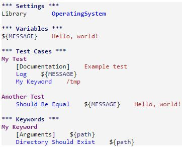

# RobotFramework

基於 Python 的開源自動化測試框架,測試個案類似user story

### Install

`#pip3 install robotframework`

### Run

`#pybot tests`: 跑過資料夾所有test case

`#pybot tests/test1`: 跑test1 case

`#pybot --variable {variable} tests/test1`: 附上變數測試

執行後產生report(log.html,output.xml, report.html)可直接由瀏覽器觀看

### Test data syntax

支援格式有HTML, TSV, TXT/ROBOT等

以TXT/ROBOT (plain text)為例

包含四部分: Settings, Variables, Keywords 和 Test Cases.

Setting: 載入所需檔案

Variables: 設定參數

Keywords: 使用者自訂關鍵字

Test Cases: 執行的測試

### Ref

[Robot Framework User Guide](http://robotframework.org/robotframework/latest/RobotFrameworkUserGuide.html)

[科科和測試](https://kkboxsqa.wordpress.com/2014/06/25/robot-framework-script-%E7%9A%84%E9%95%B7%E7%9B%B8%EF%BC%9F/)

[wsunccake's githun note](https://github.com/wsunccake/myNote/blob/master/python/robotframework.md)

[Robot Framework 快速入門](http://carl.logdown.com/posts/2014/03/07/robotframework-gettingstarted)